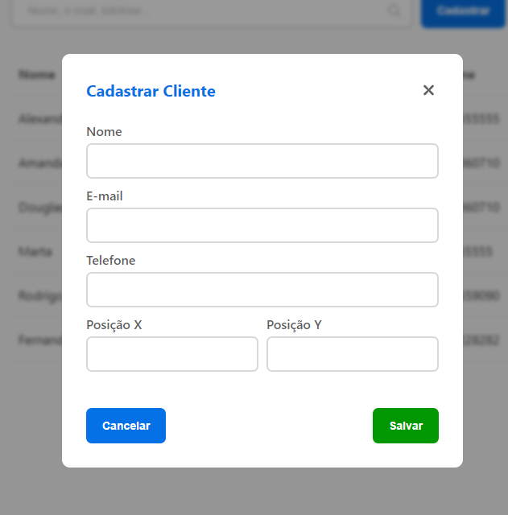

# Facilita Clientes

**Desafio técnico - Facilita Jurídico**

Um app para cadastro e visualização de clientes, com a possibilidade de calcular o menor caminho de viagem entre as localizações dos clientes.

## Design e Figma

Acompanha um mockup da tela principal no [Figma](https://www.figma.com/file/qx9ADUFr6iI3S32vK2JMQV/Facilit%C3%A1?type=design&node-id=0%3A1&mode=design&t=iahrQKg2qkDLoyeZ-1).

Screenshots:




# Executando Localmente

## Docker

> :warning: **Em caso de windows:** caso o git esteja configurado para trocar LF para CRLF e caso não seja possível manter o frontend ou o backend aberto, possivelmente você precisa ajustar os arquivos `frontend/run.sh` e `backend/run.sh` para seren salvos com `LF`. Para isso abra e salve como LF ambos os arquivos, ou configure seu git para aceitar LF.

Caso você tenha Docker, é possível rapidamente rodar os 3 containers (frontend, backend e postgreSQL) através do uso do docker-compose.yml. Certifique-se que o Docker Engine está rodando, clone o repositório, acesse a pasta raíz do projeto e execute o comando abaixo:

```
sudo docker compose up
```

A build dos 3 containers irá começar, e então serão executados. Se executado no Windows por WSL poderá ocorrer uma demora maior, por limitação do acesso ao filesystem
por parte do WSL, principalmente no frontend.

A importação do DDL do banco de dados deverá ocorrer automaticamente na primeira vez que usar `docker compose up`.
Caso isso não ocorra, para realizar a importação do banco de dados, será necessário acessar o postgreSQL dentro do container. Para isso, execute o comando:

```
sudo docker exec -it facilita-clientes-db-1 bash
```

Assim terá acesso à linha de comando do container do banco de dados. O arquivo .sql estará na pasta raiz do sistema `/data.sql`.

Para acessar o site em seu navegador, acesse `localhost:80`.

## Ambiente Próprio

É possível também rodar no seu próprio ambiente. Certifique-se da compatibilidade das versões das dependências:

| dependência | versão        |
| ----------- | ------------- |
| Node.js     | 20.11.0 (LTS) |
| postgreSQL  | 16.1          |

Clone o repositório em um terminal e navegue até a pasta frontend, execute `npm install`, e então, `npm run start`.

Então, abra outro terminal e acesse backend, novamente execute `npm install` e então
`npm run dev`.

Garanta que seu postgreSQL esteja rodando, crie um database chamado `facilita_douglas` e então importe o `data.sql` localizado na pasta `postgres` do projeto.
Para acessar seus serviços use as portas listadas abaixo.

# Portas

| serviço    | Porta |
| ---------- | ----- |
| frontend   | 80    |
| backend    | 3033  |
| postgreSQL | 5432  |
| adminer    | 8080  |

# Arquitetura

**Os arquivos .env foram colocados no Github para fins de facilitar a usabilidade, mas em casos reais não deveriam ser versionados.**

A estrutura de arquivos é representada por um monorepo, com separação do frontend e do backend em serviços distintos, com sua própria forma de ser hospedada. Essa separação foi realizada para facilitar o escalonamento através de instanciamento e distribuição carga para cada serviço.

A dockerização desses serviços permite facilmente preparar um ambiente provisionado pronto para uso em infraestruturas como AWS, Azure, GCP ou Firebase.

No caso de Firebase seria necessário alterar a arquitetura para executar na forma de Cloud Functions.

## Backend

O backend foi construido em Typescript com Express. O uso do Typescript aumenta a confiabilidade do código, principalmente em área mais delicadas, como o backend. Foi estruturado baseado em uma variação da arquitetura MVCS (model-view-controller-service).

-   **View:** representada nesse caso como as rotas do Express, serve como ponto de entrada para a API. Encaminha os dados da requisição para o controller correto.
-   **Controller:** Responsável por validar os dados da requisição, executar o service correto, e então empacotar a resposta.
-   **Service:** é onde habitam as regras negociais. Utiliza os models livremente e realiza o processamento dos dados.
-   **Model:** a camada de abstração em cima do banco de dados. Realiza queries SQL diretamente. Usados por services.

A arquitetura MVCS foi escolhida pois permite separar as regras negociais dos passos de tratamento e validação de dados (payload), que habita o controller. Com isso é mais fácil realizar testes unitarios, pois existe uma separação de responsabilidade, e permite criar mocks focados. Uma alternativa é a validação de dados por middlewares do Express.

O uso do typescript acaba por criar uma série de interface para payloads e para respostas, como é o caso de `ClientCreationPayload` e `ClientCreateResponse`. Apesar de verbosos, eles permitem representar os pacotes de dados na forma de um contrato, facilitando o processo de desenvolvimento.

O postgreSQL possui a database `facilita_douglas`, nomeada desta forma para reduzir a chance de conflito em seu ambiente local.

# Frontend

O frontend foi construido em javascript com React, servido localmente através do servidor de desenvolvimento do do create-react-app. Em produção pode ser executado através do script `server.js`, usando `node ./server.js`.
A utilização do javascript serve para constratar com o uso do typescript no backend, que não era um requerimento do desafio.

Utiliza SCSS para parametrizar cores e facilitar a legibilidade do css.

# Rota de Menor Distância Entre Clientes

Esse requisito é equivalente ao "problema do caixeiro-viajante". A implementação de iterações entre todos os pontos resulta numa operação
combinatório com complexidade `O(n!)`, ou seja, com uma quantidade pequena de 20 clientes cadastrados, o custo do cálculo resultaria em
demora na resposta ao usuário e maior uso de processamento.

Para isso se usa métodos heurísticos que aproximam do valor ideal, sacrificando precisão por redução de complexidade. Na implementação realizada neste projeto, foi optado por implementar um algoritmo 2-opt, também conhecido como método de Monte Carlo, para realizar a ordenação dos clientes em uma rota adequada. Para mais informações,
a função foi documentada no backend.

Os dados do banco presentes no `data.sql` devem simular o seguinte caso, criado no Desmos:


Com a execução do algoritmo, resulta no seguinte caminho:


O resultado pode ou não ser o caminho ideal, mas como este processo é uma aproximação, acredito que está numa margem aceitável de erro. Podem ser feitas melhorias, como realizar um pré-processamento com algum algoritmo como nearest-neighbor ou algoritmo de Christofides, e então usar 2-opt ou 3-opt, reduzindo a chance da solução cair numa mínima local.

Referência: [Comparison of TSP Algorithms](https://pja.mykhi.org/4sem/NAI/rozne/Comparison%20of%20TSP%20Algorithms/Comparison%20of%20TSP%20Algorithms.PDF)

# Melhorias

Algumas melhorias que não couberam no escopo do desafio.

### Backend

-   Autenticação
-   ORM para ter uma interface consistente no acesso ao banco de dados.
-   Realizar validações de payload em middlewares ao invés do controller.
-   CORS incorretamente configurado caso utilizado em produção.
-   algum processo de throttling das requisições para reduzir possível abuso.
-   ordenação correta dos clientes na listagem, provavelmente de forma alfabética. Mantido como ordenado por ID pois facilita a execução do teste de cálculo de distância.
-   Aumentar a precisão do cálculo da menor distância usando outro algoritmo, como nearest-neighbor inicialmente, e então pós-processar com o 2-opt.

### Frontend

-   Feedback de carregamento da lista de clientes e das rotas, como um spinner.
-   Edição e remoção de clientes.
-   Utilização de tailwindcss.
-   Adicionar uma validação mais robusta no envio de forms, com erros personalizáveis e dinâmicos, ao invés de depender das propriedades do HTML, como `required` e `type="email"`.
